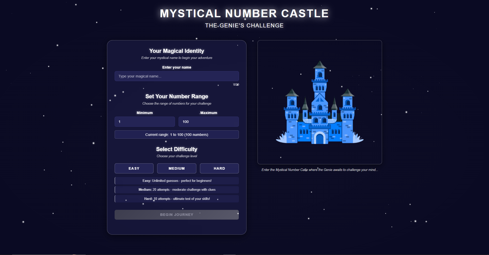

# 🏰 Mystical Number Castle - Jogo de Adivinhação Interativo

**Jogo web interativo onde o jogador desafia um gênio em um castelo místico, tentando adivinhar o número secreto.**

[](LICENSE)
[]()
[]()
[](https://mysticalnumbercastle.netlify.app/)

## 📌 Sumário

1. [Sobre o Projeto](#-sobre-o-projeto)
2. [Objetivos](#-objetivos)
3. [Tecnologias](#-tecnologias)
4. [Funcionalidades](#-funcionalidades)
5. [Pré-requisitos](#-pré-requisitos)
6. [Instalação](#-instalação)
7. [Como Jogar](#-como-jogar)
8. [Estrutura do Projeto](#-estrutura-do-projeto)
9. [Contribuição](#-contribuição)
10. [Licença](#-licença)
11. [Contato](#-contato)
12. [Recursos Adicionais](#-recursos-adicionais)


## 💻 Sobre o Projeto

O **Mystical Number Castle** é um jogo web onde o jogador deve adivinhar o número secreto escolhido por um gênio dentro de um castelo místico. O jogo oferece diferentes níveis de dificuldade, placar de líderes, interface responsiva e efeitos visuais para uma experiência imersiva e divertida.

### 🕹️ Histórico e Evolução

Este projeto é uma evolução do jogo original criado em C pela Ana Monteiro, disponível em [Primeiro-Joguinho (GitHub)](https://github.com/AnaMonteirodev/Primeiro-Joguinho). A primeira versão era totalmente em linha de comando (CLI).

A nova versão web foi desenvolvida em colaboração, trazendo uma interface gráfica moderna, responsiva e com novos recursos. O objetivo foi transformar a experiência clássica de adivinhação em algo visualmente envolvente e acessível a todos os públicos.

### 🎮 Jogue Agora!

Acesse a versão em produção do Mystical Number Castle:

👉 [Jogar Mystical Number Castle](https://mysticalnumbercastle.netlify.app/)

## 🎯 Objetivos

### 🛠️ Técnicos

- **Modernização e Evolução:** Migrar um jogo clássico de adivinhação em C (CLI) para uma experiência web moderna, responsiva e acessível, utilizando Vue.js 3 e Vite.
- **Escalabilidade e Manutenibilidade:** Estruturar o código em componentes reutilizáveis, modularizar estilos com SCSS e organizar o projeto para facilitar futuras expansões e manutenção.
- **Experiência do Usuário:** Proporcionar uma interface visualmente atraente, com animações, sprites customizados e responsividade total para diferentes dispositivos.
- **Acessibilidade:** Garantir navegação por teclado, contraste adequado e usabilidade para todos os públicos.
- **Performance:** Otimizar carregamento de assets (imagens, fontes, sprites) e garantir fluidez nas animações e interações.
- **Boas Práticas de Frontend:** Utilizar gerenciamento de estado centralizado (Pinia/Vuex), separação clara de domínios (componentes, views, stores, utils), e seguir padrões de código limpo.
- **Facilidade de Deploy:** Permitir deploy simples e rápido em plataformas como Netlify, com build automatizado e documentação clara.
- **Colaboração:** Facilitar contribuições externas com documentação detalhada, estrutura de pastas intuitiva e exemplos de uso.

## 🚀 Tecnologias

**Núcleo do Sistema**
- Node.js
- Vue.js 3, 
- Vite, 
- SCSS, 
- JavaScript (ES6+)
- Pinia
- Netlify (deploy)

## ✨ Funcionalidades

- ✅ **Jogo de Adivinhação**: Tente adivinhar o número secreto do gênio
- ✅ **Níveis de Dificuldade**: Fácil, Médio, Difícil
- ✅ **Leaderboard**: Veja seu desempenho e compare com outros jogadores
- ✅ **Feedback Visual**: Animações, sprites e efeitos de partículas
- ✅ **Interface Responsiva**: Jogue em qualquer dispositivo
- ✅ **Acessibilidade**: Navegação por teclado e contraste adequado
- ✅ **Temas e Fontes Customizadas**: Visual único e imersivo

## ⚙️ Pré-requisitos

- **Node.js** (versão LTS 18+)
- **npm**
- **Git**


## 🛠️ Instalação

1. **Clone o repositório:**
   ```bash
   git clone https://github.com/AnaMonteirodev/mystical-number-castle.git
   cd mystical-number-castle
   ```
2. **Instale as dependências:**
   ```bash
   npm install
   npm install gsap
   npm install sass
   ```
3. **Execute o projeto em modo desenvolvimento:**
   ```bash
   npm run dev
   ```
4. **Acesse no navegador:**
   ```
   http://localhost:5173
   ```
   (ou a porta indicada pelo terminal)


## ❗ Como Jogar

- Escolha o nível de dificuldade
- Digite seu palpite no campo apropriado
- Receba dicas do gênio após cada tentativa
- Tente adivinhar o número com o menor número de tentativas
- Veja seu resultado no leaderboard


### ▶️ Demonstração




_(imagem da initial page)_

## 📂 Estrutura do Projeto

```plaintext
mystical-number-castle/
├── docs/                      # Documentação e design do projeto
├── src/
│   ├── assets/                
│   |   ├── fonts/             # Fontes
│   |   ├── images/            # Imagens
│   |   |   ├── genie-sprites/ # Sprites do genio
│   |   ├── styles/            # Estilos (SCSS)
│   ├── components/            # Componentes Vue
│   |   ├── common/            # Domínio: Comum
│   |   ├── effects/           # Domínio: Efeitos
│   |   ├── game/              # Domínio: Jogo
│   |   ├── leaderboard/       # Domínio: Placar
│   ├── stores/                # Gerenciamento de estado
│   ├── utils/                 # Funções utilitárias
│   ├── views/                 # Telas do app
│   └── main.js                # Ponto de entrada da aplicação
├── index.html                 # HTML principal
├── package.json               # Dependências e scripts
├── vite.config.js             # Configuração do Vite
└── README.md                  # Este arquivo
└── LICENSE                    # Licença
```

## 🤝 Contribuição

Contribuições são bem-vindas! Siga estas etapas:

### **1. Reporte Bugs**
- Abra uma [issue](https://github.com/AnaMonteirodev/mystical-number-castle/issues) no GitHub
- Descreva o problema detalhadamente
- Inclua logs e screenshots se possível

### **2. Sugira Melhorias**
- Envie ideias através de issues
- Proponha novas funcionalidades
- Discuta melhorias de arquitetura

### **3. Desenvolva**
- Faça um fork do projeto
- Crie uma branch (`git checkout -b feature/nova-funcionalidade`)
- Faça suas alterações seguindo os padrões do projeto
- Adicione testes para novas funcionalidades
- Faça commit (`git commit -m 'feat: nova funcionalidade'`)
- Envie um Pull Request

## 📜 Licença

MIT License - Veja [LICENSE](LICENSE) para detalhes.


## 📞 Contato

- **Autor**: [Lucas Leria](https://github.com/lucasgleria)
- **Colaboradora**: [Ana Monteiro](https://github.com/AnaMonteirodev)
- **Designer Colaborador**: [Johnathan Carvalho](https://www.linkedin.com/in/johnathan-carvalho-alves-84b71822a/)


## 🔍 Recursos Adicionais

- [Documentação Técnica](docs/documentation.md)
- [Design do Projeto](docs/design-plan.md)
- [Vue.js](https://vuejs.org/) - Documentação oficial
- [Vite](https://vitejs.dev/) - Documentação oficial
